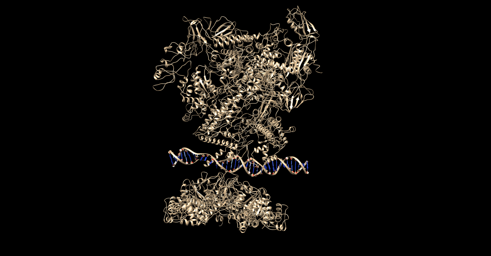
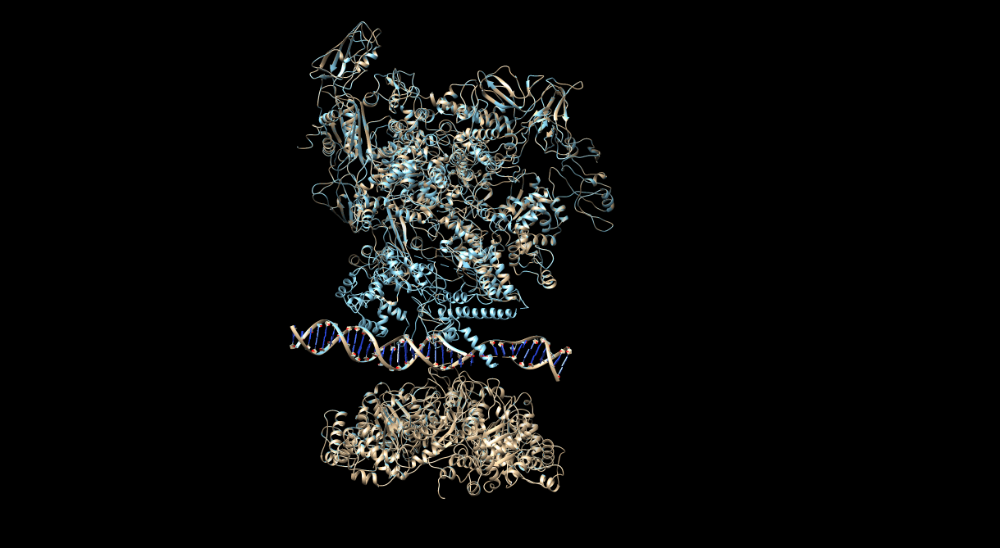
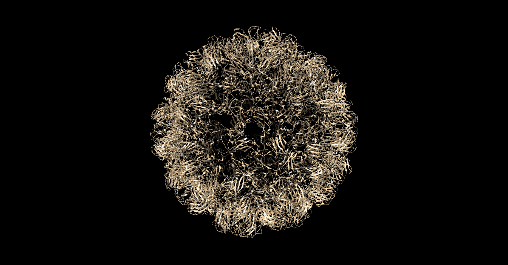
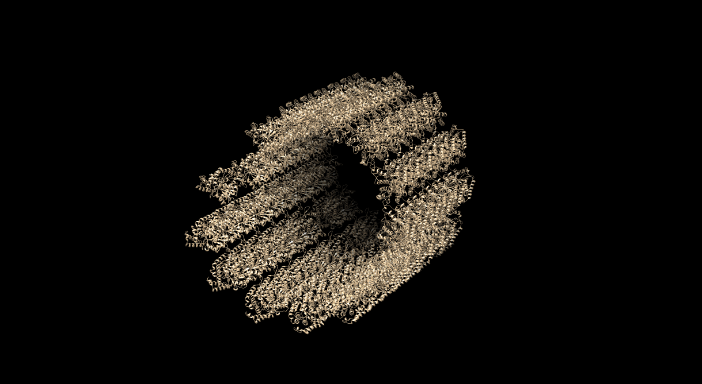

**MacroFlexEngine**
===================================
*by* Natalia Pattarone, Joan Térmens, Miguel Luengo

# 1. Introduction

MacroFlexEngine is a python application that allows the construction of protein and dna macrocomplexes from pdb information of the dimers that form this complex. Furthermore if a fasta file of the whole complex is inputed it will detect which parts of the complex are given and which are missing and complete the missing parts using modeller.

# 2. Running the application

## 2.1 Requirements
The application requires Python 3 to be able to run as well as several python modules: 
```
Biopython library 
Modeller
Numpy 
```
## 2.2 Installation
The application can be installed by running the following commands:
For linux distributions and Mac ios:
```bash
python setup.py sdist
python setup.py install
```
For windows:
```bash
python setup.py bdist_wininst
```
## 2.3 Execution
To execute the application the following command can be run
```bash
python MFEngine-launch -i absolute_path_to_pdb_folder
```
As well as the mandatory input flag there are several optional ones:
```
-o –output: The output file containing the final complex 
-v verbose: More detailed process information
-f -fasta: FASTA file for uncompleted models
-p -profile: Show the energy profile of the output model 
```
By default the program will output a pdb file with the whole macrocomplex. If a folder is specified the output will be saved there. 

# 3. Theoretical Background
The main approach for the building of the complex used in this application is superimposition. The program finds the identical chains in the input dimers by alignment based on their identity value, superimposes them and then moves the remaining chain of the dimer. This way the complex is formed. The program ends when no more chains can be added because of clashes. This means that this program does not need the stoichometry as an input since it will add chains until all the space is explored.  
## 3.1 Data treatment
First of all the input dimer pdbs are read and the chains and interactions are saved separately. With these variables saved they can now be compared to the fasta file if it is inputed to check if there is a missing chain.  
## 3.2 Modeller
If there are chains missing the structure modeller is use to obtain it. The pdb database is used to obtain templates for the missing fasta sequence using ???blastp???. Then the alignment is done between the best templates. With these alignment the model can be created with modeller.    
## 3.3 Alignment
The alignment process consists of two steps to know which chains of the two structures must be superimposed. In the first place a pairwise sequence alignment of all of the chains is done. If the identity between two chains is higher than a certain score it is considered an homolog and will be superimposed. The identity is calculated with a score of 1 for matches and a value of 0 otherwise with no special gap penalty. Afterwards when the structural alignment for the superimposition is carried out the rmsd is calculated and if the normalised value is lower than 1 Å the chain is discarded and the following is tested.
## 3.4 Superimposition
The superimposition is the main part of the program. The process will start with two input dimers. The common chain found in the alignment process will be superimposed and the remaining chain will be moved to form a complex with three chains. Then the process will be repeated with the complex that has been created and another one of the inputed dimers. Each time a new chain is added to the model the program checks if it causes a clash. If there are no clashes the chain is added. This allows the formation of macro-complexes with many repeating units without the need of a stoichometry and the program will always input the most complete protein possible. The algorithm for the clash calculation is explained below. 
## 3.5 Clash Checking
Before moving a chain and adding it to the model the program will check if the new position creates a clash with the existing structure. This is done by calculating the distance betweeb the center of mass of the chain being added and its furthest atom and an imaginary sphere is drawn between the two points plus two Å. Then, the distance between each of the atoms from the other chains that are within the sphere and the atoms from the moved chain will be calculated. If the distance between two of these atoms is greater than 1.1 Å will be considered a clash. If more than 10 clashes are found for a specific chain being added to the complex  this chain will  be discarded and the following one will be evaluated. If there are no more chains to be evaluated the program ends. 
## 3.6 Output Analysis
?????????

# 4. Examples
## RNA polymerase with promoter DNA and transcription activator
### PDB id: 5nss

This is an example of a complex protein structure with dna interaction. It has 10 protein chains and a DNA double helix. The input for this complex is the chains that form the complex separated in dimers. The execution time for this complex is around 40 seconds. The model is represented in light brown and the original pdb in light blue.The result is the following.The rmsd was normalised using the formula developed by Carugo and Pongor (2001). The normalised rmsd is calculated as follows, rmsd_100 = rmsd / 1+ln(sqrt(N/100)) where the N is the length of the shortest of the chains.  


*Fig. 1: 5nss model with original complex. RMSD:0*

This result was obtained without modifying the input chains of the intial complex but even when they were moved and rotated randomly the program was still able to obtain very good results with a very low rmsd. The following figure shows that even with added noise the algorithm is able to replicate the reference complex perfectly. 


*Fig. 2: 5nss model with original rotated chains. RMSD:0,001*


## Virus Capsid
Example of virus capsid built from the repetition of few input chains and their interactions. Here we can see one of the strengths of the program. With only a few chains a macro complex can be formed by adding the same structure until a clash happens when the sphere is already completed.


*Fig. 3: Virus capsid model*

## Microtubul
Example of protein microtubul. The original model obtained is very large(around 670000 atoms) so the chimera software could not handle it. The version shown is a segment of the whole complex. Similarly to the virus model this large complex is formed from only a few initial dimers. 


*Fig. 3: Fragment of the microtubul model*

## About this document

This document can be compiled into a PDF with the following command:

```{.sh}
pandoc -f gfm -t latex                  \
       --variable papersize:a4paper     \
       --variable geometry:margin=1.5cm \
       --variable fontsize=11pt         \
       --highlight-style pygments       \
       -o report2.pdf	\
          report2.md
```


